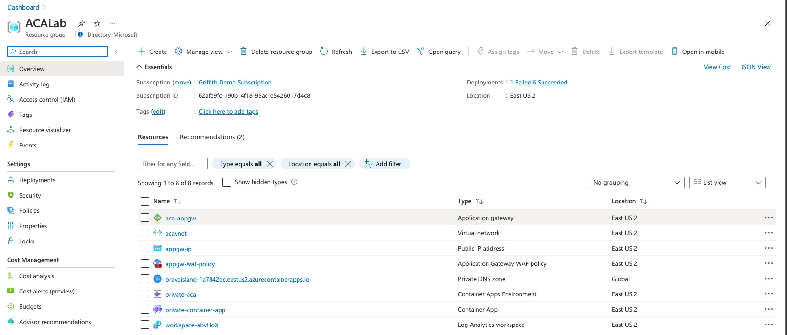
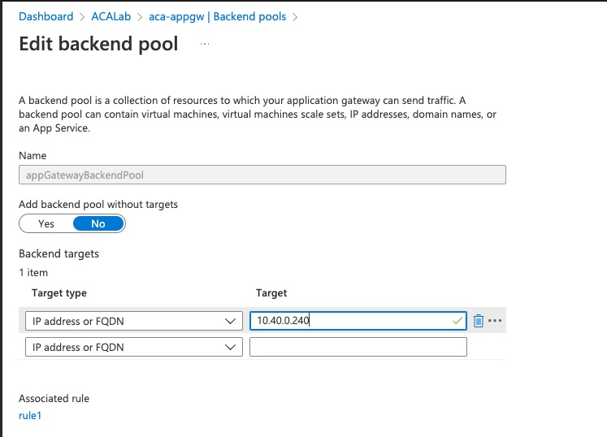
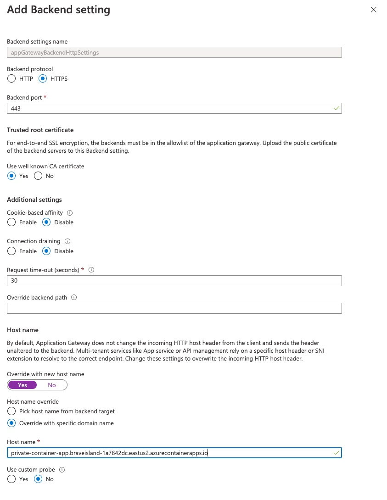
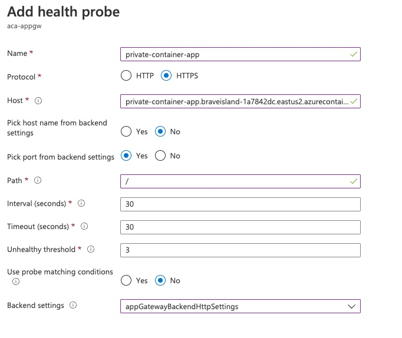

# Setting up ACA Private with Azure App Gateway

The following walk through demonstrates how to set up Azure Container Apps in private mode and then how to front-end your privately exposed service with a public endpoint from Azure App Gateway with WAF enabled.

## Setup

First to leveral Azure Container Apps (hereafter ACA) you need to make sure the extension is installed in your CLI and the provider is registered on your target subscription. Most steps will use the [Azure CLI](https://learn.microsoft.com/en-us/cli/azure/install-azure-cli), however we may need to jump out to the portal at points.

### Enable ACA

```bash
# Login to your azure account
az login

# Set the target subscription
az account set -s <SubscriptionID>

# Install/Upgrade the ACA Extension
az extension add --name containerapp --upgrade

# Register the providers
az provider register --namespace Microsoft.App
az provider register --namespace Microsoft.OperationalInsights
```

### Create the network

To simulate brining your own VNet, we'll be creating an Azure Virtual Network here. You could, however, use your own Vnet and subnets, as long as the meet the [requirements](https://learn.microsoft.com/en-us/azure/container-apps/vnet-custom?tabs=bash&pivots=azure-cli#create-an-environment) documented by Azure Container Apps.

```bash
# Set Variables
RESOURCE_GROUP=ACALab
LOCATION=eastus2

# Create Resource Group
az group create -n $RESOURCE_GROUP -l $LOCATION

VNET_NAME=acavnet

# Create Vnet
az network vnet create \
-g $RESOURCE_GROUP \
-n $VNET_NAME \
--address-prefix 10.40.0.0/16 \
--subnet-name priv-aca-env-subnet --subnet-prefix 10.40.0.0/23

az network vnet subnet create \
-g $RESOURCE_GROUP \
--vnet-name $VNET_NAME \
-n appgw-subnet \
--address-prefixes 10.40.2.0/23

# Get the Vnet ID
VNET_ID=$(az network vnet show --resource-group ${RESOURCE_GROUP} --name ${VNET_NAME} --query id --out tsv)

# Get the subnet resource IDs
PRIV_ACA_ENV_SUBNET_ID=$(az network vnet subnet show -g $RESOURCE_GROUP --vnet-name $VNET_NAME -n priv-aca-env-subnet --query id -o tsv)
```

### Create the ACA Environment

Now that we have the Virtual Network in place, and have retrieved the resource IDs for the VNet and Subnet, we can deploy our ACA Environment. We'll set our environment to internal only, since we don't plan to expose any external addresses from the environment, but will instead use Azure App Gateway for public ingress. This may take a few minutes. While it deploys you may want to go have a read through [Container Apps Network Architecture Docs](https://learn.microsoft.com/en-us/azure/container-apps/networking).

```bash
PRIV_CONTAINERAPPS_ENVIRONMENT=private-aca

az containerapp env create \
--name $PRIV_CONTAINERAPPS_ENVIRONMENT \
--resource-group $RESOURCE_GROUP \
--location $LOCATION \
--internal-only true \
--infrastructure-subnet-resource-id $PRIV_ACA_ENV_SUBNET_ID
```

### Deploy an app

Now that we have our environment, we'll deploy our app. 


```bash
# Deploy an app to the private environment
az containerapp create \
--name private-container-app \
--resource-group $RESOURCE_GROUP \
--environment $PRIV_CONTAINERAPPS_ENVIRONMENT \
--image mcr.microsoft.com/azuredocs/containerapps-helloworld:latest \
--target-port 80 \
--ingress 'external' \
--query properties.configuration.ingress.fqdn

PRIVATE_APP_FQDN=$(az containerapp show -g $RESOURCE_GROUP -n private-container-app -o tsv --query properties.configuration.ingress.fqdn)

```

### For Private ACA set up the private DNS Zone

For Azure Container Apps to be routable by FQDN internal to the VNet, we need to create a private zone and an A-Record to provide DNS resolution.

```bash
# Get the App FQDN
ENVIRONMENT_DEFAULT_DOMAIN=$(az containerapp env show --name ${PRIV_CONTAINERAPPS_ENVIRONMENT} --resource-group ${RESOURCE_GROUP} --query properties.defaultDomain --out tsv)

# Get the App Private IP
ENVIRONMENT_STATIC_IP=$(az containerapp env show --name ${PRIV_CONTAINERAPPS_ENVIRONMENT} --resource-group ${RESOURCE_GROUP} --query properties.staticIp --out tsv)

# Create the Private Zone
az network private-dns zone create \
--resource-group $RESOURCE_GROUP \
--name $ENVIRONMENT_DEFAULT_DOMAIN

# Link the Private Zone to the Vnet
az network private-dns link vnet create \
--resource-group $RESOURCE_GROUP \
--name $VNET_NAME \
--virtual-network $VNET_ID \
--zone-name $ENVIRONMENT_DEFAULT_DOMAIN -e true

# Add the A Record to map the app FQDN to the private IP
az network private-dns record-set a add-record \
--resource-group $RESOURCE_GROUP \
--record-set-name "*" \
--ipv4-address $ENVIRONMENT_STATIC_IP \
--zone-name $ENVIRONMENT_DEFAULT_DOMAIN
```

At this point, if you wanted to test the internal service call, you could create a jump server in the Vnet and run some testing. You can jump to the [jump vm setup](#optional---create-a-jump-vm-for-testing-local-private-access)- Create a jump vm for testing local private access) section below.

### Setup the Azure App Gateway

Now that we have a routeable app in the Vnet, we can set up the App Gateway to route to it.

> **Note:**
> For this example, to keep setup simple, we'll set up the Application Gateway front end to accept traffic via it's private IP using HTTP, rather than setting up an A-Record for the Azure Application Gateway and adding a custom domain certificate to enable HTTPS. You can see the App Gateway documentation for the TLS and custom domain setup steps, which are beyond the scope of this walkthrough.

```bash
# Create the public IP for the App Gateway
az network public-ip create \
--resource-group $RESOURCE_GROUP \
--sku Standard \
--name appgw-ip 

# Get the public IP
APPGW_IP=$(az network public-ip show -g $RESOURCE_GROUP -n appgw-ip -o tsv --query ipAddress)

# Create a blank WAF Policy - which is needed when deploying App Gateway with WAF enabled
az network application-gateway waf-policy create \
--name appgw-waf-policy \
--resource-group $RESOURCE_GROUP

# Create the application gateway
az network application-gateway create --name aca-appgw \
--resource-group $RESOURCE_GROUP \
--vnet-name $VNET_NAME \
--subnet appgw-subnet  \
--min-capacity 0 --max-capacity 2 \
--priority 100 \
--public-ip-address appgw-ip \
--sku WAF_v2 \
--waf-policy appgw-waf-policy
```

Now that we have our Application Gateway, we'll link it to the Azure Container App. These steps are more easily done via the portal, for this excercise. You can use ARM templates or Bicep if you prefer.


1. Go to the Azure portal at [https://portal.azure.com](https://portal.azure.com)
2. Navigate to your resource group, either by navigating to your resource groups list and clicking on it, or entering your resource group name in the search box at the top of the screen.
   
    

3. Click on your application gateway

    

4. Select 'Backend Pools' and then click on 'appGatewayBackendPool'

    

5. In the backend pools configuration, set the backend pool target to the private IP address of your ACA environment, which is the value you should have stored in the ENVIRONMENT_STATIC_IP environment variable. Once entered, click 'Save'/

> **Note:**
> The private IP of the environment is static and is shared as the ingress for all applications you deploy to the environment. Traffic is routed to the specific app based on the port or host header of the inbound request, so you can share the common backend across multiple inbound configurations.

    

6. Go to the 'Backend Settings' section. This is set to port 80 and HTTP by default, but our backend is using HTTPS, so we need to update. Make the following changes and then click 'Save':
    * Change the 'Backend protocol' setting to HTTPS
    * Set 'Use well known certificate' to 'Yes'
    * Set 'Override with new hostname' to 'Yes'
    * Enter the private FQDN of the Container App (The value you should have stored in the PRIVATE_APP_FQDN environment variable) in the 'Host Name' text box. (**Warning:** Don't mix up the FQDN of the Environment with the FQDN of the App)

    Your backend settings should now look like the following:

    

### Test the App Gateway

Now we can try to run a curl against the application gateway public IP.

```bash
# Curl the app gateway
curl -Liv $APPGW_IP
```

### Optional - Add a health probe to the App Gateway

You will likely see a warning when you open your Azure Application Gateway in the portal that looks like the following:


To address this, you can add a health probe for the backend service, as follows:

1. From the application gateway in the portal, click on 'Health Probes'.

    

2. Click the '+ Add' button at the top of the screen, fill in the following details and click 'Save':

    * Name: private-container-app
    * Protocol: HTTPS
    * Host: Use the value of PRIVATE_APP_FQDN (ex. private-container-app.braveisland-1a7842dc.eastus2.azurecontainerapps.io)
    * Path: /
    * Backend Settings: appGatewayBackendHttpSettings
    * Leave the rest as default values

    

3. Click 'Test' to verify the settings
   
   You should see output like the following:

   

4. Click 'Add'
   

### Optional - Create a jump vm for testing local private access 

```bash
# Add a subnet for the jump server
az network vnet subnet create \
-g $RESOURCE_GROUP \
--vnet-name $VNET_NAME \
-n jump-subnet \
--address-prefixes 10.40.4.0/23

# Get the jump subnet id
JUMP_SUBNET_ID=$(az network vnet subnet show -g $RESOURCE_GROUP --vnet-name $VNET_NAME -n jump-subnet --query id -o tsv)

# Create VM Public IP
az network public-ip create \
--resource-group $RESOURCE_GROUP \
--name jump-ip 

# Create the NSG for the jump server
az network nsg create \
--resource-group $RESOURCE_GROUP \
--name jump-nsg

az network nsg rule create \
--resource-group $RESOURCE_GROUP \
--nsg-name jump-nsg \
--name jumpSSH \
--protocol tcp \
--priority 1000 \
--destination-port-range 22 \
--access allow

az network nic create \
--resource-group $RESOURCE_GROUP \
--name jumpNIC \
--vnet-name $VNET_NAME \
--subnet jump-subnet \
--public-ip-address jump-ip \
--network-security-group jump-nsg

az vm create \
--resource-group $RESOURCE_GROUP \
--name jump \
--location $LOCATION \
--nics jumpNIC \
--image UbuntuLTS \
--admin-username azureuser \
--generate-ssh-keys
```
